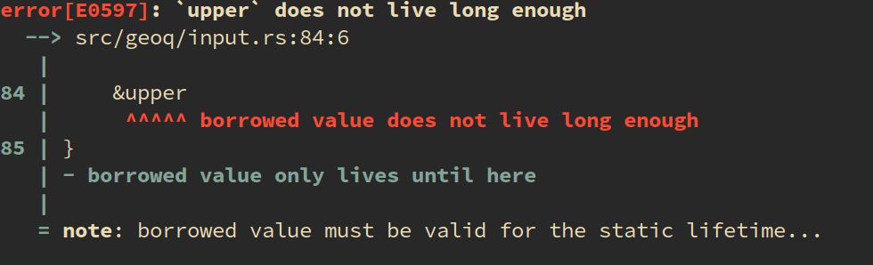
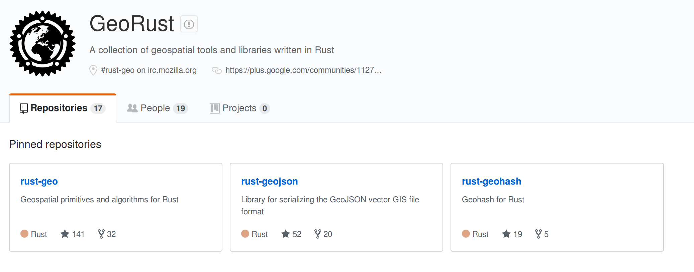

# Geoq - A geospatial CLI

```sh
echo 9q5c | geoq wkt
# POLYGON((-118.4765625 33.92578125,-118.125 33.92578125,-118.125
#         34.1015625,-118.4765625 34.1015625,-118.4765625 33.92578125))

echo 34.1,-118.2 | geoq gj geom
# {"coordinates":[-118.2,34.1],"type":"Point"}

cat /my/points.tsv | geoq map
# go look at your browser!
```

---

# Goals

* Unify some common GIS operations - **Replace copy-and-paste workflows**
* Be easy to use
* "DWIM" -- try to read common formats automagically without guidance from user
* Be relatively fast (maybe more fast in the future)
* Be streaming
* Learn some stuff along the way

---

# GIS Tools -- Lay of the Land

* [JTS](https://github.com/locationtech/jts) - The "original" modern open source geometry library
* [Geos](http://geos.refractions.net/ro/doxygen_docs/html/) - C++ port of JTS
* [RGeo](https://github.com/rgeo/rgeo) - Ruby - partially a set of bindings to Geos
* [Shapely](https://github.com/Toblerity/Shapely) - Python - Also uses Geos for some functionality
* [TurfJS](https://github.com/Turfjs/turf) - Haven't used this much but seems to be good and all native javascript
* [RustGeo](https://github.com/georust/rust-geo) - **New and Shiny** - Rust library providing similar functionality. Still new but getting pretty good.

---

## [geoq-rb](https://github.com/worace/geoq-rb)

* First attempt in Ruby.
* Used RGeo for GIS operations
* Actually worked pretty well.
* Helped figure out the concept and refine the API
* Kind of slow -- both in run time and startup time

---

## [geoq](https://github.com/worace/geoq)

* Rust rewrite
* Provide native binary executables (faster startup, potentially easier distribution)
* Be faster
* Learn Rust along the way
* "Kick the tires" of the Rust GIS ecosystem

---

# Rust Basics

* New-ish language -- dates from 2010, but picking up lots of traction in last couple years
* "Systems" programming language -- in theory can do anything C and C++ can do
* Kind of like if C++ & Haskell & Ruby had a child
* Has a fancy type system that checks memory usage
* Aims to eliminate lots of common memory-management mistakes via compile-time analysis
* No runtime, but a lot of fancy compile-time abstractions make it feel very ergonomic

```rust
fn main() {
    println!("Hello World!");
}
```

---

## "Borrow Checker"

```rust
fn illegal_borrow(s: String) -> &'static String {
    let upper = s.to_uppercase();
    &upper
}
```



---

## Rust Taste

```rust
fn parsed_geojson_entities(gj: GeoJson) -> Vec<Entity> {
    match gj {
        GeoJson::Geometry(gj_geom) => vec![Entity::GeoJsonGeometry(gj_geom)],
        GeoJson::Feature(gj_feature) => vec![Entity::GeoJsonFeature(gj_feature)],
        GeoJson::FeatureCollection(gj_fc) => gj_fc
            .features
            .into_iter()
            .flat_map(|f| parsed_geojson_entities(GeoJson::Feature(f)))
            .collect(),
    }
}
```
---

## State of GIS in Rust



* They have some pretty decent libraries
* Some things are not totally complete yet (I have had to add a bunch of things to the WKT library)
* [Sometimes there are bugs](https://github.com/georust/rust-geojson/pull/99)
* But there is enough stuff there to build this library on

---

## Usage / Setup

Install using Cargo, the rust package manager (similar to Ruby's Bundler).

```sh
# if you don't have rust toolchain installed:
curl https://sh.rustup.rs -sSf | sh

# Add cargo's bin directory to your path
export PATH="$HOME/.cargo/bin:$PATH"

cargo install geoq

# view the manual
geoq help
```

* [Github](https://github.com/worace/geoq)
* [Install Instructions](https://github.com/worace/geoq#install)
* [Manual](https://github.com/worace/geoq/blob/master/manual.md)

---

## Demo

### Input Formats:

* Lat/Lon (comma or tab separated)
* WKT
* GeoJSON
* Geohash (base 32)
* **One input per line**

```sh
echo 9q5 | geoq type
# Geohash(9q5)
```

---

## Other Commands

See `geoq help <command>` for more info

* `gj` - convert to geojson
* `wkt` - convert to wkt
* `gh` - stuff with geohashes
* `filter` - select inputs based on spatial predicates
* `map` - pipe to geojson.io

```
40.245991504199026,-122.78320312499999
36.1733569352216,-116.630859375
44.96479793033101,-100.8984375
34.88593094075317,-105.029296875
```

```
LINESTRING (30 10, 10 30, 40 40)
POLYGON ((30 10, 40 40, 20 40, 10 20, 30 10))
```
