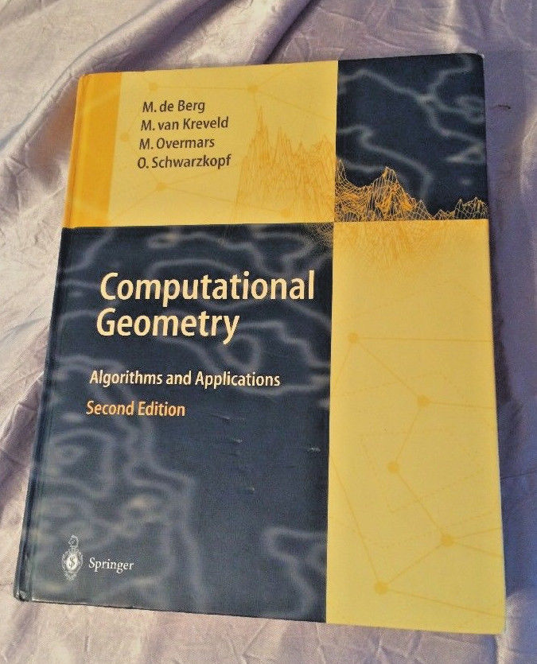
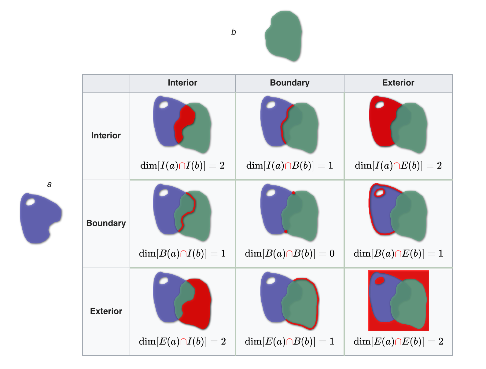
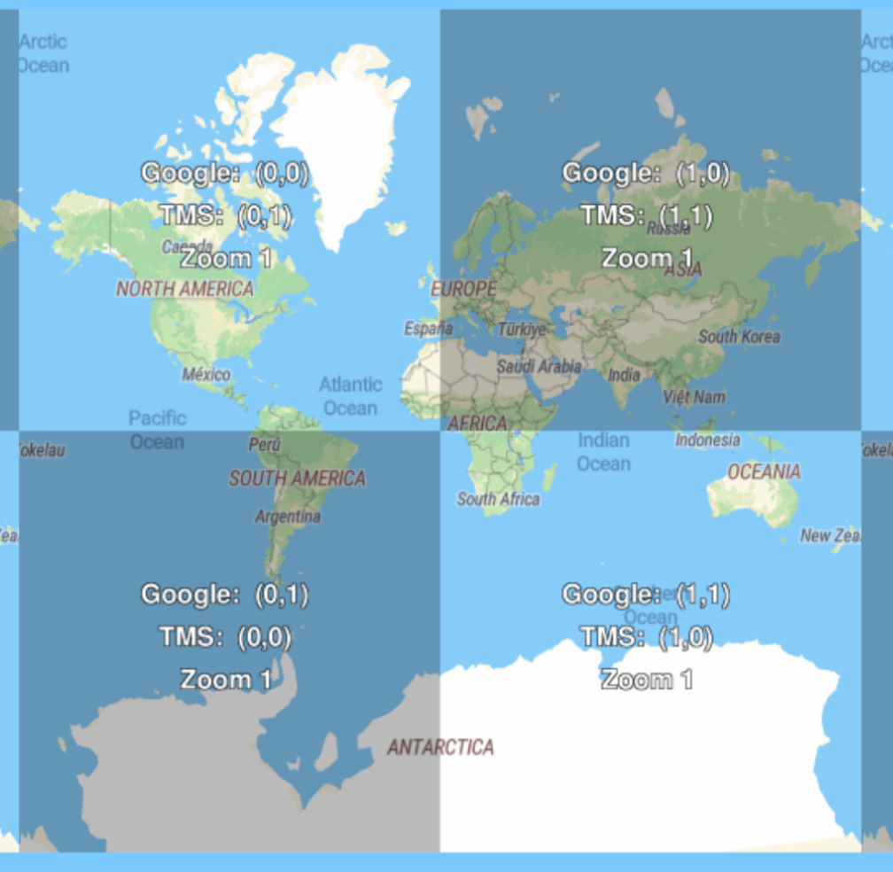
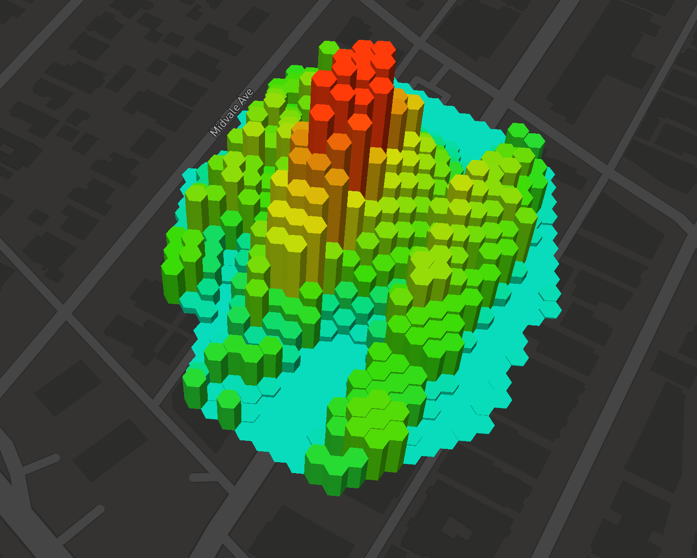

class: middle

# Rust + GeoSpatial

[twitter.com/worace](http://twitter.com/worace)

[github.com/worace](http://github.com/worace)

[Factual](http://www.factual.com/) (my job!)

#### 1 - Domain + Concepts

#### 2 - History + Existing Tools

#### 3 - GeoRust Ecosystem

#### 4 - Geoq Intro + Demo

---
class: middle

# 1. GeoSpatial Intro

1. Basics - Shapes!
2. More basics - Globes!
3. Extras: Grids
4. Extras: Serialization

---

### Shapes! (Computational Geometry)

.fl-left.w-40[
* Take it back to High School geometry
* Euclidean data types
  * Points
  * Lines
  * Polygons
* Euclidean Queries
  * Intersection
  * Containment
* Euclidean Manipulation
  * Cutting / Rotating / Buffering / etc.
]



---

### [DE9IM](https://en.wikipedia.org/wiki/DE-9IM)

* "Dimensionally Extended nine-Intersection Model (DE-9IM)"
* Standard Topological model used by most GIS libraries



---

### Basic Geometry Example (with PostGIS)

```sql
select ST_Contains( -- Ask if this polygon contains the point 0,0
  ST_Buffer( -- Buffer the point to make a polygon
    ST_Point(0,0), -- Make a point with X/Y coordinate
    10
  ),
  ST_Point(0,0)
);
```

```
 st_contains
-------------
 t
(1 row)
```

[WKT](https://gist.githubusercontent.com/worace/d430d150269e1abe5f2c46881d620fe8/raw/628c2ee9e9335ceeba0dd25046acccce6297c8fe/st_buffer.txt)

---

### Euclidean Problems

```sql
select ST_Distance( -- Distance b/t 2 points
  -- Note X/Y == Lon/Lat
  ST_Point(-118.2437, 34.0522), -- LA Lat/Lon
  ST_Point(-74.0060, 40.7128) -- NYC Lat/Lon
);
```

```
   st_distance
------------------
 44.7363129197076
(1 row)
```

#### 44.73...whats?

* 44.73 == 44.73 "degrees" on a flattened cartesian plane
* For most GIS applications, pure euclidean operations are only part of the puzzle

---

### GIS Part 2 - [Geodesy](https://en.wikipedia.org/wiki/Geodesy)

.fl-left.w-50[
* Earth is a sphere
  * ...or an ellipsoid
  * ...or a really lumpy ellipsoid
* **Geodesy:** Science of measuring the Earth's shape
* Great Circle Distance (i.e. what airplanes use)
* Distance algorithms
  * [Vincenty](https://en.wikipedia.org/wiki/Vincenty%27s_formulae)
  * [Haversine](https://en.wikipedia.org/wiki/Haversine_formula)
]


---

### Distance Revisited

```sql
select ST_Distance(
  -- Tell PostGIS to use Geodesic types for this query
  ST_Point(-118.2437, 34.0522)::geography,
  ST_Point(-74.0060, 40.7128)::geography
);
```

```
   st_distance
------------------
 3944422.23148992
(1 row)
```

#### 3944422.23 meters == 3944 km ✅

---

### GIS Related Tools: Grids

* Spatial grids are another common tool in GIS work
* Lets us slice space into discrete identifiable chunks
* [Geohashes](https://en.wikipedia.org/wiki/Geohash)
* [QuadTrees](https://en.wikipedia.org/wiki/Quadtree)
* [S2 (Google)](http://blog.christianperone.com/2015/08/googles-s2-geometry-on-the-sphere-cells-and-hilbert-curve/)
* [H3 (Uber)](https://uber.github.io/h3/#/)

---

### Grids: [Geohashes](https://en.wikipedia.org/wiki/Geohash)

.fl-left.w-50[
* Variable-precision 60-bit encoding of lat/lon
* Implementations exist for most languages
* Can encode to text using Base32
* e.g. 9q5c3u86
* Encoding follows a [Space-Filling Curve](https://en.wikipedia.org/wiki/Space-filling_curve), so adjacent GeoHashes are also spatially proximate
* [Factual Blog Post: How Geohashes Work](https://www.factual.com/blog/how-geohashes-work/)
]


---

### Grids: [QuadTiles](https://www.maptiler.com/google-maps-coordinates-tile-bounds-projection/)

.fl-left.w-40[
* Most web maps use this
* Start with 4 tiles, and subdivide by 4 at each zoom level
]



---

### Grids: [H3](https://uber.github.io/h3/#)

.fl-left.w-40[
* New Hexagonal grid system from Uber
* Hexes have only 1 "class" of neighbor
* Nice for visualizations and certain kinds of "flow" analysis
* [Implementation in C](https://github.com/uber/h3/)
* _Very_ WIP port to rust: [worace/h3-rs](https://github.com/worace/h3-rs)
]


---

### GIS Tools: Serialization

* Different CompGeo libraries will have their own methods for representing geometries internally
* However standard serialization formats are needed for interchange
* Common formats:
  * WKT
  * GeoJSON
  * WKB (more compact representation of WKT)
* Many CompGeo libraries include support for these

---

### Serialization: Well-Known Text

```wkt
POINT (30 10)
LINESTRING (30 10, 10 30, 40 40)
POLYGON ((30 10, 40 40, 20 40, 10 20, 30 10))
POLYGON ((35 10, 45 45, 15 40, 10 20, 35 10),
         (20 30, 35 35, 30 20, 20 30))
MULTIPOLYGON (((40 40, 20 45, 45 30, 40 40)),
              ((20 35, 10 30, 10 10, 30 5, 45 20, 20 35),
               (30 20, 20 15, 20 25, 30 20)))
```

* Simple, text-based format
* aka WKT, "wicket"

[raw](https://gist.githubusercontent.com/worace/aedba48b8a09f7d45318448054dd3fd3/raw/6a4031661d27da3268ca8f0f9438540dfb8aec70/example.txt)

---

### Serialization: GeoJSON


```json
{"type":"Point",
 "coordinates":[30.0,10.0]}
{"type":"LineString",
 "coordinates":[[30.0,10.0],[10.0,30.0],[40.0,40.0]]}
{"type":"Polygon",
 "coordinates":[
  [[35.0,10.0],[45.0,45.0],[15.0,40.0], [10.0,20.0],[35.0,10.0]],
  [[20.0,30.0],[35.0,35.0],[30.0,20.0],[20.0,30.0]]]}
{"type":"Feature",
 "properties":{},
 "geometry":{"type":"Point",
             "coordinates":[30.0,10.0]}}
```
* Similar structure to WKT, but uses a JSON-based format
* Additional types: **Feature** and **FeatureCollection** for containing optional `properties` data
* Better support for additional metadata than WKT (can just embed JSON properties)
* [More than you ever wanted to know about GeoJSON](https://macwright.org/2015/03/23/geojson-second-bite.html) by Tom MacWright
* Nice Trick: Put a `*.geojson` file in a Github Gist and they will [map it](https://gist.github.com/worace/4a863b0063b149397ccded1fbe09dc86)

---

### GIS Libraries -- Lay of the Land

* [JTS](https://github.com/locationtech/jts) - The "original" modern open source geometry library
  * [Spatial4J](https://github.com/locationtech/spatial4j) - Geodesic Extensions for JTS
  * [factual/geo](https://github.com/factual/geo) - Clojure GIS Library based on JTS + Spatial4J
* [Geos](http://geos.refractions.net/ro/doxygen_docs/html/) - C++ port of JTS
* [PostGIS](https://postgis.net/) - PostgreSQL Extension for GIS support
  * Uses GEOS under the hood
  * Amazing interface and docs
  * Many people's "gateway" to GIS
* [RGeo](https://github.com/rgeo/rgeo) / [Shapely](https://github.com/Toblerity/Shapely) - Ruby/Python GEOS bindings
* [TurfJS](https://github.com/Turfjs/turf) - Native JS implementations (browser-compatible)
* **[GeoRust](https://github.com/georust/rust-geo)** - Rust -- **new + shiny**
  * Pure Rust implementation of standard geospatial types + algos
  * Uses common Rust patterns to give idiomatic feel

---

## GIS in Rust


* Most efforts consolidated under [github.com/georust](https://github.com/georust/)
* Include libraries for:
  * Standard Geo Types
  * Euclidean + Geodesic operations
  * Geohashes
  * Common serialization formats

---

### Tour of GeoRust: Basic Types

* Source is under [georust/geo](https://github.com/georust/geo) but published under its own crate [geo_types](https://docs.rs/geo-types/0.3.0/geo_types/)
* Implements types for individual geometries (`Point`, `Polygon`, etc)
* Types are generic over numeric types (but in practice I have only used `f64`)
* Exposes a [Geometry Enum](https://docs.rs/geo-types/0.3.0/geo_types/enum.Geometry.html) which allows pattern matching on individual types

```rust
use geo_types::Point;

// X,Y -> Lon, Lat
let p = Point::new(-118.3991, 33.9949);


```

```rust
use geo_types::{Point, LineString, Polygon};
// Polygon is represented as collection of rings
// Uses From trait to allow conversion from
// Vec<CoordinateType<T>>
let poly = Polygon::new(vec![[0., 0.], [10., 0.], [0., 0.]].into(),
                        vec![]);
```

---

### Tour of GeoRust: Core Algorithms

* Source is under [georust/geo](https://github.com/georust/geo) and published as [geo](https://crates.io/crates/geo)
* Modules under `geo::algorithm` expose Traits for adding additional behavior onto geometric types

```rust
use geo_types::Point;
// Trait adds vincenty_distance method to Point type
use geo::algorithm::vincenty_distance::VincentyDistance;
let la = Point::new(-118.3991, 33.9949);
let ny = Point::new(-74.0060, 40.7128);
let distance = la.vincenty_distance(&ny);
// Ok(3960119.117836607)
```

* Numerous [other algorithms](https://docs.rs/geo/0.11.0/geo/algorithm/index.html#modules) are available in this way

---

### Tour of GeoRust: Geohash

* [github: georust/geohash](https://github.com/georust/geohash) / [crates.io: geohash](https://crates.io/crates/geohash)
* Provides Encode/Decode (using `geo_types` types) and neighbor-finding helpers

```rust
use geohash::decode;

let gh = "9q5c3u86";

let (
  coord, // Coordinate { x: -118.39914321899414, y: 33.99487495422363 }
  lon_err, // 0.000171661376953125
  lat_err, // 0.0000858306884765625
) = decode(gh).expect("Invalid Geohash");
```

---

### Tour of GeoRust: WKT / GeoJSON

* [WKT](https://github.com/georust/wkt)
* [GeoJSON](https://github.com/georust/geojson)
* Encode/Decode geo_types to WKT and GeoJSON
* WKT uses a custom parser; GeoJSON uses [serde](https://github.com/serde-rs/serde)
* Both work well, although like most Rust I/O there is lots of error handling


---

### Tour of GeoRust: Summary

* Support is growing all the time
* [Sometimes](https://github.com/georust/rust-geojson/pull/99) there are [bugs](https://github.com/georust/geohash/pull/25)
  * More users helps find and fix these!
* Tools I have shown are all _pure Rust_
  * Means the GeoRust people made them from scratch
* Some other, more obscure tools are still available as C bindings
  * (maybe **you** could be the one to port them?)

---

# New Tool: Geoq

### [github.com/worace/geoq](https://github.com/worace/geoq)

* Rust-based GeoSpatial command-line tool
* Unify common GIS operations - **Replace REPL-based, copy-and-paste workflows**
* Be easy to use
* "DWIM" -- Read common formats automagically without guidance from user
* Be streaming
* Integrate well with existing unix tools (sort, uniq, etc)

---

## [geoq-rb](https://github.com/worace/geoq-rb)

* First attempt in Ruby.
* Used RGeo for GIS operations
* Actually worked pretty well.
* Helped figure out the concept and refine the API
* Kind of slow -- both in run time and startup time

---

## [geoq](https://github.com/worace/geoq)

* Rust rewrite
* Provide native binary executables (faster startup, potentially easier distribution)
* Be faster
* Learn Rust along the way
* "Kick the tires" of the Rust GIS ecosystem
* Using [Clap](https://docs.rs/clap/2.32.0/clap/) for CLI parsing
* Using various GeoRust packages for GIS operations
* **Caveats:** I have definitely been learning Rust while developing this, so there are likely many rookie mistakes and also bugs...

---

## Commands

```
$ geoq help
geoq 0.0.10
geoq - GeoSpatial utility belt

USAGE:
    geoq <SUBCOMMAND>

SUBCOMMANDS:
    centroid    Print centroid of the given geometry
    filter      Select features based on geospatial predicates
    gh          Work with geohashes
    gj          Output features as GeoJSON
    help        Prints this message or the help of the given subcommand(s)
    json        Best-guess conversions from geo-oriented JSON to GeoJSON
    map         View features on a map using geojson.io
    read        Information about reading inputs with geoq
    whereami    Get IP-based current lat/lon.
    wkt         Output features as Well-Known Text
```

---

## Demo

### Input Formats

* Read Features from STDIN -- **One input per line**
  * Lat/Lon (comma or tab separated)
  * WKT
  * GeoJSON
  * Geohash (base 32)

```sh
$ echo 9q5 | geoq read
# Geohash: 9q5
$ echo "Point(0 0)" | geoq read
# WKT: POINT(0 0)
$ echo '{"type": "Point", "coordinates": [0,0]}' | geoq read
# GeoJSON Geometry: {"type": "Point", "coordinates": [0,0]}
```

---

### Format Conversions

Convert to WKT or GeoJSON

```sh
# wkt to geojson
$ echo "Point(0 0)" | geoq gj geom
# {"coordinates":[0.0,0.0],"type":"Point"}
```

```sh
# geohash to wkt
$ echo 9q5 | geoq wkt
# POLYGON((-119.53125 33.75,...))
```

---

### Mapping

Display input on a map using [geojson.io](http://geojson.io)

```sh
echo 9q5 | geoq gh neighbors | geoq map
```

### Filtering + Multi-Core

(run htop)

```sh
cat ~/data/msft_buildings/9q5_features.json \
  | geoq filter intersects 9q5c3 \
  | wc -l
```

* Uses [round-robin worker queue](https://github.com/worace/geoq/blob/master/src/geoq/par.rs#L60-L151) to process STDIN lines in parallel
* Learned a lot from this [RipGrep breakdown](https://blog.mbrt.it/2016-12-01-ripgrep-code-review/)

---

## Questions / Play Time!

### Install + Get Sample Data

Pulled a sample of the [Microsoft Building Dataset](https://github.com/Microsoft/USBuildingFootprints) within the geohash `9q5c3`

```sh
# Install geoq
cargo install geoq
# Download some sample geojson data to play with
wget https://gist.githubusercontent.com/worace/c2ca547d93b37c65a9cab12762de10e4/raw/08f5f5b0b3822de2181718a331d761b11468a431/9q5c3_msft_buildings.json
```

* Use `geoq help` to list commands
* Use `geoq help <subcommand>` for more info on that command
